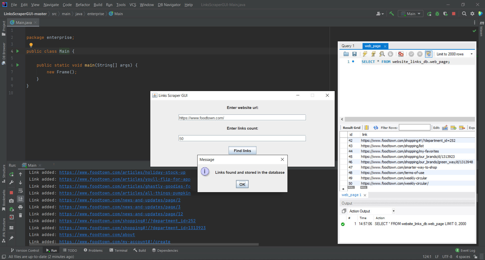

## links-scraper-gui

### URL links scraper with simple GUI example of Java code for extracting links from the pages of the specified website

***Description:***

Codes feature is that only those links that belong 
to the domain of the same website on which the search is performed are retrieved. 
Upon completion of the extraction of links, they are recorded in the database 
in the corresponding table. When searching for links, you must specify their expected number. 
If the number of searched links exceeds the number of links on the site, then the search is terminated, 
and all found links are recorded in the database. 
It is also possible to create a separate JAR file 
to run the program outside your IDE 
through the terminal of the installed operating system.

***How to use:***

First, create a new "database" schema in your local database (I used MySQL),
then add your username and password in the hibernate.cfg.xml configuration file.
Create the Main class run configuration in your IDE and start the program.
You will see a graphics window with two fields.
In the "website URL" field, enter the website from which you are going to extract links,
and in the "links count" field, enter the number of links you are looking for.

***Tools used:***

Java  
Maven  
Jsoup  
Hibernate  
MySQL  
